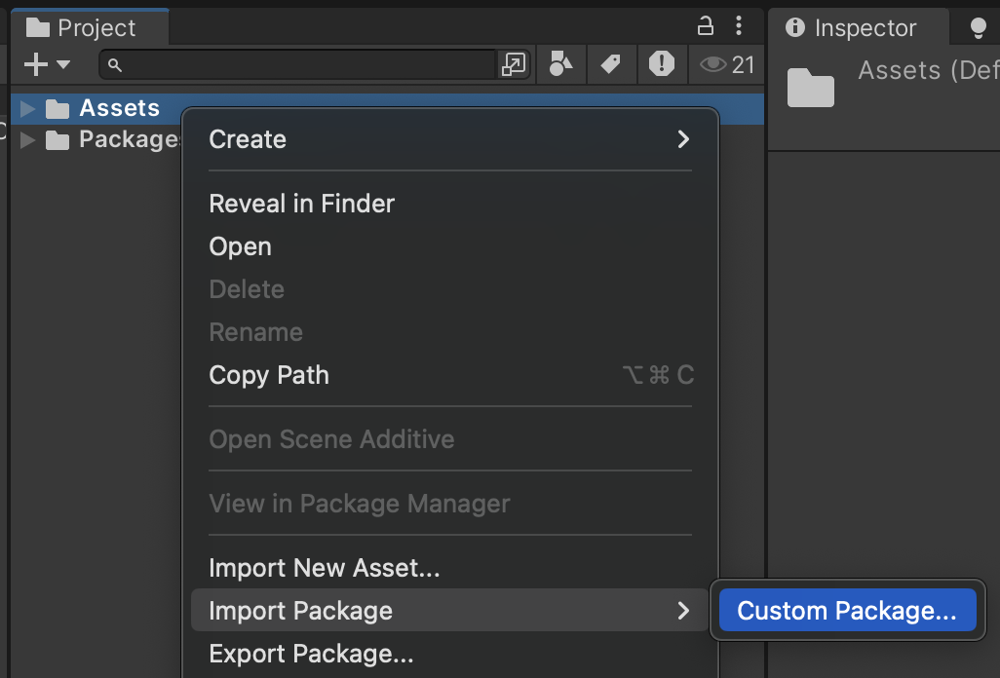
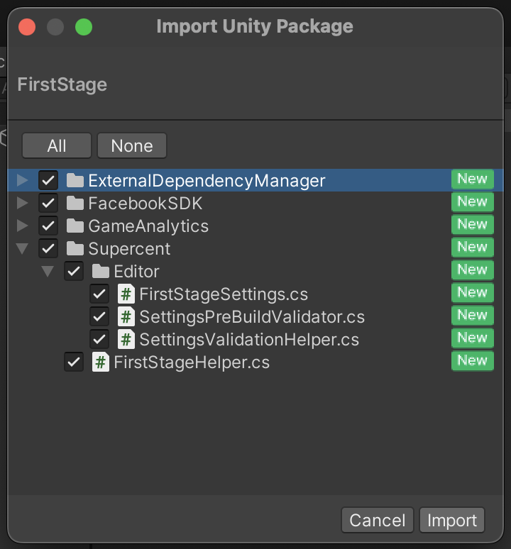
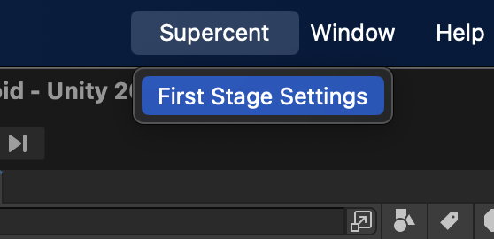
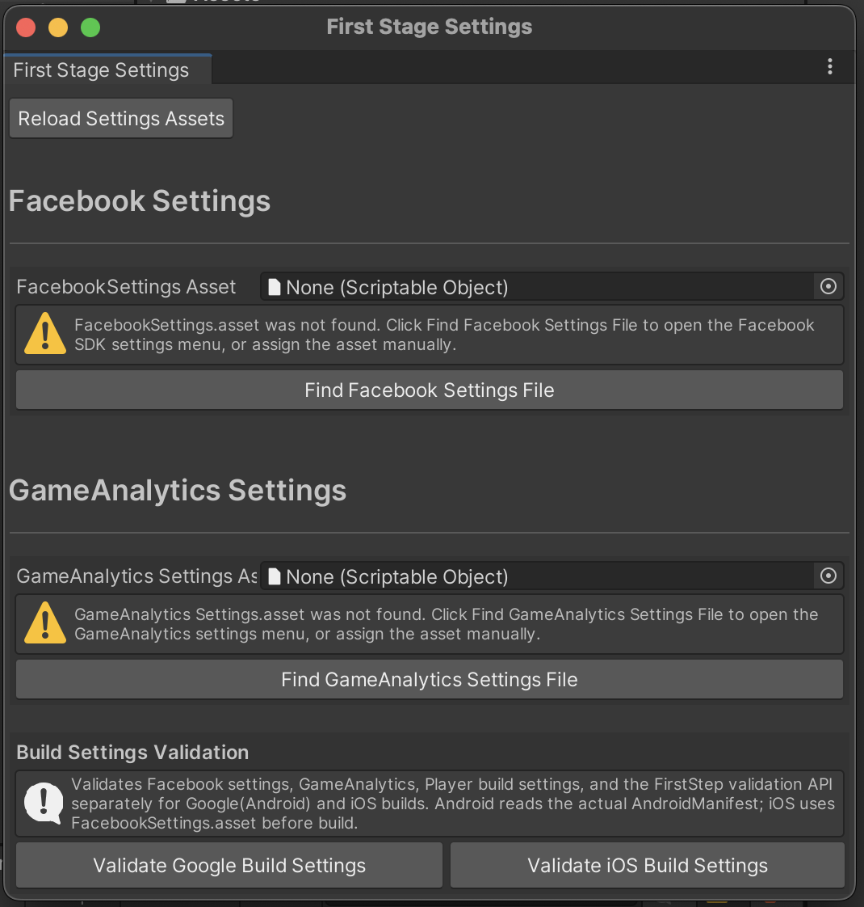
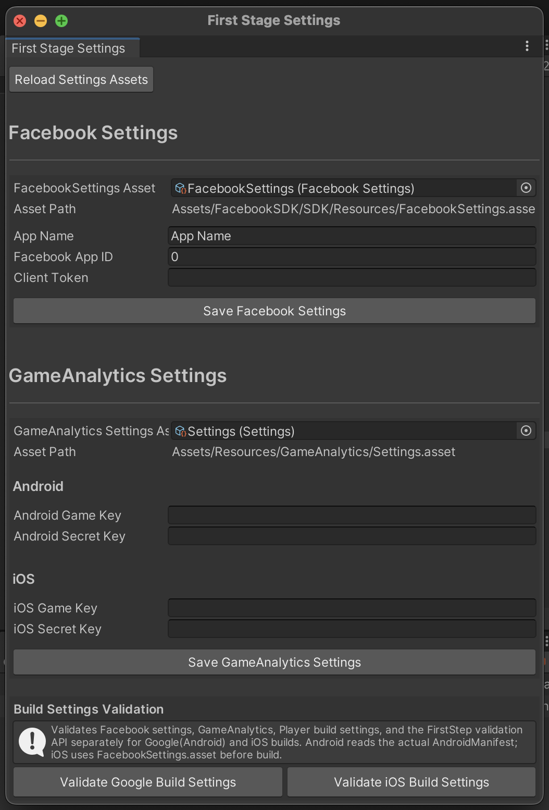
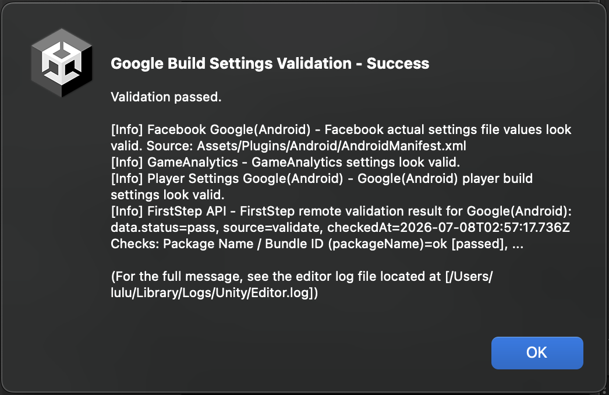
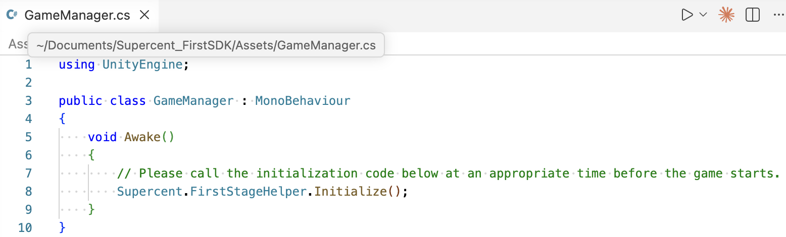

# Welcome to the Supercent FirstSDK.
Please follow the guide below to integrate the SDK.

## Installing the FirstStage Module
Download the released FirstStage.unitypackage.

Import the package into your target Unity project.

## Configuring Module Integration
From the top menu bar, navigate to and select Supercent > First Stage Settings.

If this is your first time installing Facebook and GameAnalytics, a warning message will appear.

Click the Find Facebook Settings File and Find GameAnalytics Settings File buttons.

After configuring Facebook and GameAnalytics, click the Save button for each.

Once all settings are complete, click each Validate button at the very bottom to verify your setup.

If the configuration is valid, you will see a Validation - Success message.

## Initialize module integration

Please call the initialization code below at an appropriate time before the game starts.

## Finalizing Integration Registration
The module integration is finalized and transmitted during the app build process.
Please make sure to proceed all the way through to the build stage.
